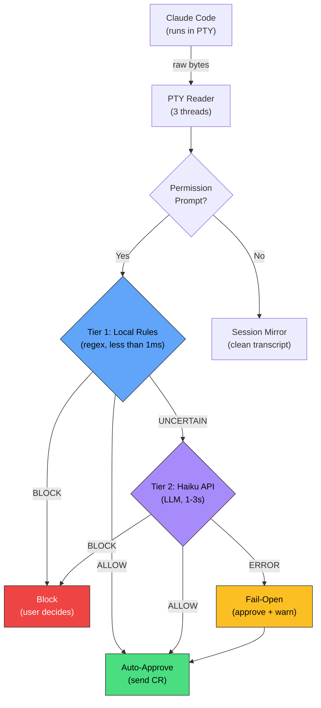

# Unleashed

> **Permission bypass for Claude Code — with a safety net.**

Unleashed is a PTY wrapper that intercepts Claude Code's permission prompts and auto-approves them, enabling fully autonomous coding sessions. Sentinel — the integrated safety gate — evaluates commands before approval using a three-tier architecture: fast local rules, Haiku API evaluation, and fail-open error handling.

## The Problem

| Challenge | Reality |
|-----------|---------|
| Claude Code asks permission 25-50 times per session | Each prompt breaks flow state and requires context switching |
| Autonomous sessions require auto-approval | Manual approval defeats the purpose of AI-assisted development |
| Blind auto-approval is dangerous | A hallucinating LLM could `rm -rf` the wrong directory |
| Safety gates add latency | 1-3 seconds per API call × 50 prompts = session destroyed |
| Safety systems that break workflow get disabled | A disabled safety system provides zero safety |

## The Solution



## Key Features

| Feature | What It Does | Why It Matters |
|---------|-------------|---------------|
| **Permission Auto-Approval** | Detects permission prompts via PTY byte patterns, sends CR | 25-50 prompts eliminated per session |
| **Sentinel Safety Gate** | Three-tier command evaluation before approval | Catches `rm -rf`, force-push, secret exfiltration |
| **Local Rules** | 12 safe patterns + 19 hard blocks resolve 80%+ instantly | No perceptible latency for common commands |
| **Session Mirror** | ANSI-stripped, garbage-filtered live transcript | Know what happened in autonomous sessions |
| **95-Pattern Garbage Filter** | Removes Ink rendering artifacts from mirror output | Readable transcripts from unreadable byte streams |
| **Friction Logger** | Tracks every permission prompt with timing data | Measure and optimize approval performance |
| **Shadow Mode** | Log sentinel decisions without acting on them | Validate before enabling safety gates |

## Architecture

Three threads manage the PTY lifecycle:

| Thread | Responsibility |
|--------|---------------|
| **t1: Stdin Reader** | Keyboard input → Windows key code mapping → PTY write |
| **t2: PTY Reader** | PTY output → terminal display + permission detection + mirror |
| **t3: Resize Monitor** | Terminal dimensions → PTY window size updates |

Worker threads handle sentinel API calls without blocking the PTY reader. See [Architecture wiki](https://github.com/martymcenroe/unleashed/wiki/Architecture) for the full technical breakdown.

## Quick Start

```bash
# 1. Clone and install
git clone https://github.com/martymcenroe/unleashed.git
cd unleashed && poetry install

# 2. Add the tier system to ~/.bash_profile
_unleashed_run() {
  local script="$1"; shift
  local project_path
  project_path="$(cygpath -w "$(pwd)")"
  (cd /c/Users/mcwiz/Projects/unleashed && \
   poetry run python "src/$script" --cwd "$project_path" "$@")
}

unleashed() {
  _unleashed_run unleashed-c-21.py --sentinel-shadow --mirror --friction "$@"
}

# 3. Run from any project directory
cd ~/Projects/my-project
unleashed

# 4. Optional: beta/alpha tiers for testing new versions
unleashed-beta() {
  _unleashed_run unleashed-c-22.py --mirror --friction "$@"  # example
}
```

See [Version Promotions](https://github.com/martymcenroe/unleashed/wiki/Version-Promotions) for the tier system and promotion workflow.

## Sentinel Safety Gate

Sentinel evaluates commands through three tiers before auto-approval:

| Tier | Method | Latency | Handles |
|------|--------|---------|---------|
| **1. Local Rules** | Regex patterns from `~/.agentos/` | <1ms | 80%+ of commands |
| **2. Haiku API** | LLM evaluation via `claude-3-5-haiku-latest` | 1-3s | Ambiguous commands |
| **3. Fail-Open** | Approve with warning on API error | 0ms | Network/API failures |

### Scope Configuration

```bash
# Bash commands only (default)
--sentinel-scope bash

# Bash + file operations
--sentinel-scope write

# All tool types (audit mode)
--sentinel-scope all

# Observe without acting
--sentinel-shadow
```

See [Sentinel Safety Gate wiki](https://github.com/martymcenroe/unleashed/wiki/Sentinel-Safety-Gate) for the full deep dive.

## Session Mirror

The session mirror produces clean, human-readable transcripts from Claude Code's Ink-rendered PTY output. The pipeline:

1. **Rate-limited buffer** (200ms accumulation — catches mid-repaint artifacts)
2. **ANSI stripping** (cursor-tracking parser removes escape sequences)
3. **Garbage filter** (95 compiled regex patterns remove rendering noise)
4. **Dedup** (suppresses progressive repaint repetitions)

See [Session Mirror wiki](https://github.com/martymcenroe/unleashed/wiki/Session-Mirror) for the rendering challenge story.

## Roadmap

All 45+ open issues are organized on the **[Unleashed Roadmap](https://github.com/users/martymcenroe/projects/6)** project board.

| Priority | Focus | Key Issues |
|----------|-------|------------|
| **P0** | Security + Reliability | API key leak ([#38](https://github.com/martymcenroe/unleashed/issues/38)), space-elimination ([#35](https://github.com/martymcenroe/unleashed/issues/35)), approval timeout ([#41](https://github.com/martymcenroe/unleashed/issues/41)) |
| **P1** | Error handling + Mirror | Bare except ([#42](https://github.com/martymcenroe/unleashed/issues/42)), ORPHAN_OSC ([#36](https://github.com/martymcenroe/unleashed/issues/36)), tree output ([#37](https://github.com/martymcenroe/unleashed/issues/37)) |
| **P2** | UX + Operations | Visual feedback ([#44](https://github.com/martymcenroe/unleashed/issues/44)), session summary ([#46](https://github.com/martymcenroe/unleashed/issues/46)), test coverage ([#30](https://github.com/martymcenroe/unleashed/issues/30)) |
| **P3** | Research | Gemini variant ([#32](https://github.com/martymcenroe/unleashed/issues/32)), pattern strategy ([#31](https://github.com/martymcenroe/unleashed/issues/31)) |

See [Roadmap wiki](https://github.com/martymcenroe/unleashed/wiki/Roadmap) for the full prioritized list.

## Documentation

### Wiki

| Page | Description |
|------|-------------|
| [Architecture](https://github.com/martymcenroe/unleashed/wiki/Architecture) | Three-thread design, data flow, component map |
| [Permission Flow](https://github.com/martymcenroe/unleashed/wiki/Permission-Flow) | Detection → extraction → approval sequence |
| [Sentinel Safety Gate](https://github.com/martymcenroe/unleashed/wiki/Sentinel-Safety-Gate) | Three-tier evaluation, scope config, stats |
| [Session Mirror](https://github.com/martymcenroe/unleashed/wiki/Session-Mirror) | ANSI stripping, garbage filtering, dedup |
| [Garbage Filter](https://github.com/martymcenroe/unleashed/wiki/Garbage-Filter) | 95-pattern engine, categories, maintenance |
| [Security Model](https://github.com/martymcenroe/unleashed/wiki/Security-Model) | Threat model, trust boundaries, known vulns |
| [Version History](https://github.com/martymcenroe/unleashed/wiki/Version-History) | Evolution from A01 to c-21, tier system |
| [Version Promotions](https://github.com/martymcenroe/unleashed/wiki/Version-Promotions) | Prod/beta/alpha tiers, promotion log |
| [Roadmap](https://github.com/martymcenroe/unleashed/wiki/Roadmap) | Priorities, GitHub Projects board |
| [For Security Reviewers](https://github.com/martymcenroe/unleashed/wiki/For-Security-Reviewers) | Security review guide, audit checklist |
| [For Contributors](https://github.com/martymcenroe/unleashed/wiki/For-Contributors) | Dev setup, code map, testing |
| [Lessons Learned](https://github.com/martymcenroe/unleashed/wiki/Lessons-Learned) | 7 lessons from building unleashed |

### Architecture Decision Records

| ADR | Decision |
|-----|----------|
| [ADR-001](docs/adrs/ADR-001-pty-wrapper-architecture.md) | PTY wrapper architecture (kbhit polling, silent approval) |
| [ADR-002](docs/adrs/ADR-002-worker-thread-sentinel.md) | Worker thread for sentinel (not inline API call) |
| [ADR-003](docs/adrs/ADR-003-fail-open-sentinel.md) | Fail-open sentinel design (availability over strictness) |
| [ADR-004](docs/adrs/ADR-004-three-tier-safety.md) | Three-tier safety (local rules → API → fail-open) |
| [ADR-005](docs/adrs/ADR-005-pty-screen-scraping.md) | PTY screen scraping (the only viable approach) |

## About

Built by a Professional Engineer who needs autonomous AI coding sessions to be productive — but also needs them to not destroy his file system.

Unleashed exists because of a fundamental tension: **productivity requires trust, and trust requires safety.** Claude Code's permission system is the right default for interactive use. But for autonomous sessions — the kind where you step away for 45 minutes and come back to finished work — manual approval defeats the purpose.

The sentinel integration is the answer to "how do you auto-approve safely?" Not by trusting blindly, and not by blocking everything, but by making fast local decisions for the obvious cases and consulting an AI for the ambiguous ones. And when even the AI can't help (API down, timeout, error), by failing open with a warning rather than freezing the session.

This is a single-user developer tool. The threat model, the design decisions, and the tradeoffs all reflect that context. For the full story, see [Lessons Learned](https://github.com/martymcenroe/unleashed/wiki/Lessons-Learned).

## License

[PolyForm Noncommercial 1.0.0](LICENSE)
